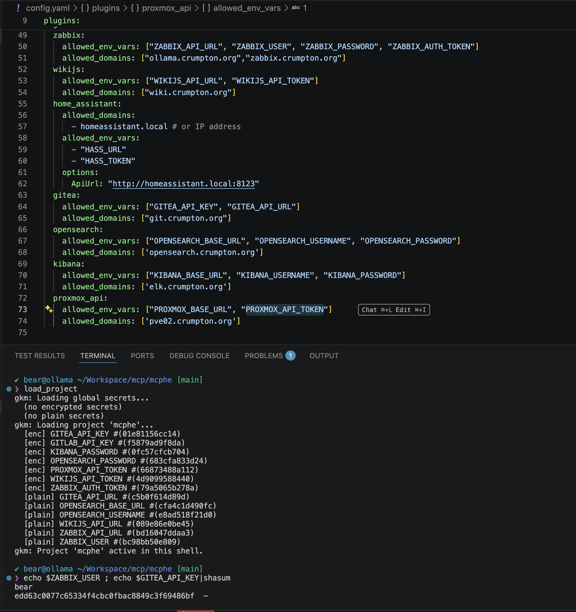

# Grimoire Key Maestro: A Centralized Secret Manager for Projects


A lightweight, CLI-driven system for managing environment variables across multiple projects with optional GPG encryption and automatic shell loading based on your current directory. I developed this because I came close to pushing secret keys to GitHub multiple times, and I wanted a more organized way to manage secrets across my projects without relying on third-party services.

This is specific to my use case gpg because my PGP keys are on YubiKeys and it is so easy to tap the disc!  However, you can use gpg without a YubiKey if you prefer, and the system will work just fine but I do recommend the GPG Agent.  The main point is that it provides a way to manage secrets in a more secure and organized way, without relying on third-party services.  Savvy people will note that the encryption/decryption can be swapped with popular CLI tools like `sops` if you prefer that workflow, but I wanted to keep it simple and use tools I already had set up.

## 🚀 Features

- **Project Isolation:** Organize secrets into specific project folders (e.g., `mcphe`, `web-app`).
- **Dual Storage Modes:**
  - **Plain:** For non-sensitive configuration (e.g., `DB_HOST`).
  - **Encrypted:** GPG-encrypted files for sensitive keys (e.g., `ANTHROPIC_API_KEY`).
- **Automatic Context Detection:** Automatically detect and load the correct project secrets when you `cd` into a directory containing a matching `.envvars` folder.
- **Smart Shell Integration:** Includes specialized shell functions to manage, view, and unload loaded variables dynamically.

---

## 📂 Project Structure

The system uses a centralized home in `~/.envvars`:

```text
~/.envvars/
├── env                 # The loader script used by your shell
├── global/             # Secrets available to all projects
│   ├── plain/         # Plain-text files
│   └── encrypted/     # .gpg files
└── [project_name]/    # Project-specific secrets
    ├── plain/
    └── encrypted/
```

---

## 🛠 Installation

1. **Clone the repository and navigate to the folder.**
2. **Run the installer:**

   ```bash
   chmod +x install.sh
   ./install.sh
   ```

3. **Configure your shell profile:**
   Add the following line to your `~/.zshrc` or `~/.bashrc`:

   ```bash
   source ~/etc/shell_profile_snippet.sh
   ```

4. **Set your GPG Recipient List:**
   In your shell profile, define who can decrypt the secrets (comma separated list of GPG key identifiers or email addresses):

   ```bash
   export PGP_RECIPIENT_LIST="your-email@example.com"
   ```

---

## 📖 Usage

### Basic Management (`gkm`)

The `gkm` tool is used to manage the storage of your secrets.

| Command | Description |
| :--- | :--- |
| `gkm init <name>` | Create a new project directory. |
| `gkm plain <var> [-p proj] [val]` | Store a plain-text variable. |
| `gkm encrypted <var> [-p proj] [val]` | Store an encrypted GPG variable. |
| `gkm list [-p proj]` | List all variables in a project. |
| `gkm projects` | List all available projects and their counts. |
| `gkm delete <var>` | Remove a variable (both plain and encrypted). |

**Example Workflow:**

```bash
# Initialize a new project
gkm init mcphe

# Add a public config
gkm plain DB_HOST -p mcphe localhost

# Add a private API key (automatically gets GPG encrypted)
echo "sk-ant-..." | gkm encrypted ANTHROPIC_API_KEY -p mcphe

# List all secrets in the project
gkm list -p mcphe

# Encrypt an existing plain variable
gkm encrypted DB_PASS -p mcphe
```

### Shell Interaction

The included shell script provides helpers to interact with your current session:

- `load_project [-p proj]`: Manually load a specific project's variables into your environment.
- `project_status`: Show which project is currently active and which variables are loaded.
- `unload_project`: Clear all variables from the current shell session.

**Automatic Loading:**
Because of the `shell_profile_snippet.sh`, if you `cd` into a folder that matches a known project, the system will detect it and notify you to run `load_project`.

---

## 🔐 Security Notes

- **Permissions:** The installer automatically sets strict permissions (`700` for directories, `600` for files) on the `.envvars` folder.
- **GPG Requirement:** All "encrypted" secrets require a valid GPG agent and must be encrypted using the keys listed in your `PGP_RECIPIENT_LIST`.
- **Plain Text Warning:** Only use `gkm plain` for information that is not sensitive enough to be leaked if the `.envvars` folder were compromised.

## Example Usage



```shell
✘ bear@workstation ~/Workspace/phanatic
❯ gkm init phanatic                                                                                                          Tue Jun 16 19:26:00
gkm: Initialized /Users/bear/.gkm/phanatic/{encrypted,plain}

✔ bear@workstation ~/Workspace/phanatic
❯ PHANATIC_PASS=$(pwgen)                                                                                                     Tue Jun 16 19:26:11

✔ bear@workstation ~/Workspace/phanatic
❯ export PHANATIC_PASS                                                                                                       Tue Jun 16 19:26:33

✔ bear@workstation ~/Workspace/phanatic
❯ PHANATIC_USER=phan4ever                                                                                                    Tue Jun 16 19:26:40

✔ bear@workstation ~/Workspace/phanatic
❯ export PHANATIC_USER                                                                                                       Tue Jun 16 19:26:53

✔ bear@workstation ~/Workspace/phanatic
❯ gkm encrypted PHANATIC_PASS                                                                                                Tue Jun 16 19:26:58
gkm: Using value from env $PHANATIC_PASS
gkm: Stored encrypted PHANATIC_PASS in project 'phanatic'
  #(d5f39bc635b8)

✔ bear@workstation ~/Workspace/phanatic
❯ gkm plain PHANATIC_USER                                                                                                    Tue Jun 16 19:27:17
gkm: Using value from env $PHANATIC_USER
gkm: Stored plain PHANATIC_USER in project 'phanatic'
  #(ed0f9037d5ba)
```